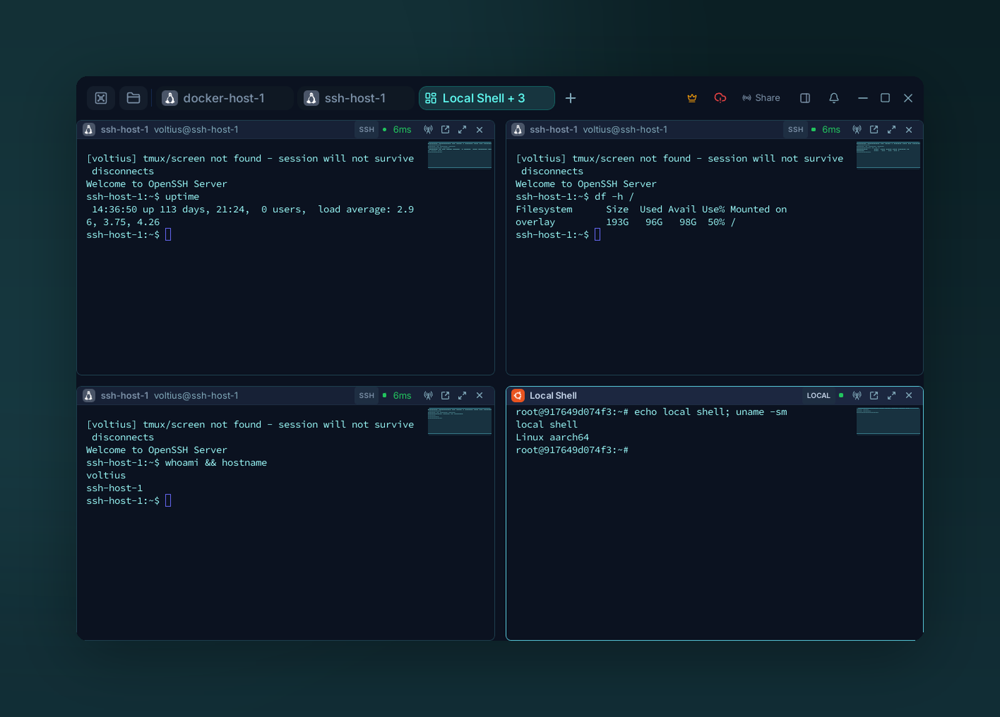
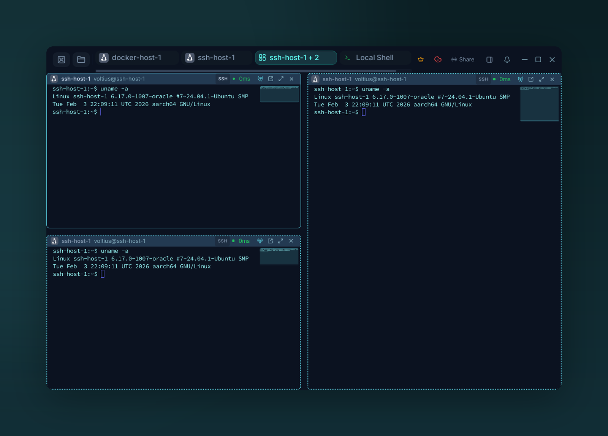

# Split panes

{ .voltius-shot }
/// caption
Split a tab into a 2×2 grid — each pane is its own session (three SSH hosts and a local shell here).
///

## Splitting

| Action | How |
| --- | --- |
| Split horizontally | Pane header menu → **Split horizontal** |
| Split vertically | Pane header menu → **Split vertical** |
| Open a different host in a pane | Drag a host card into the pane area |
| Resize | Drag the divider |
| Close a pane | Pane header → **Close** |

Panes nest — split a split, no depth limit.

## Broadcast input

{ .voltius-shot }
/// caption
Broadcast input — one keystroke stream goes to every selected pane (the accent borders mark the broadcast set).
///

Click **Broadcast** in the tab header. Every keystroke goes to all selected panes — useful for running the same command on a fleet.

A persistent yellow bar at the top of the tab signals broadcast is on. Click panes to add/remove them from the broadcast set; click the bar to exit.

!!! warning
    Broadcast is per-tab. Closing the tab clears the broadcast set.
