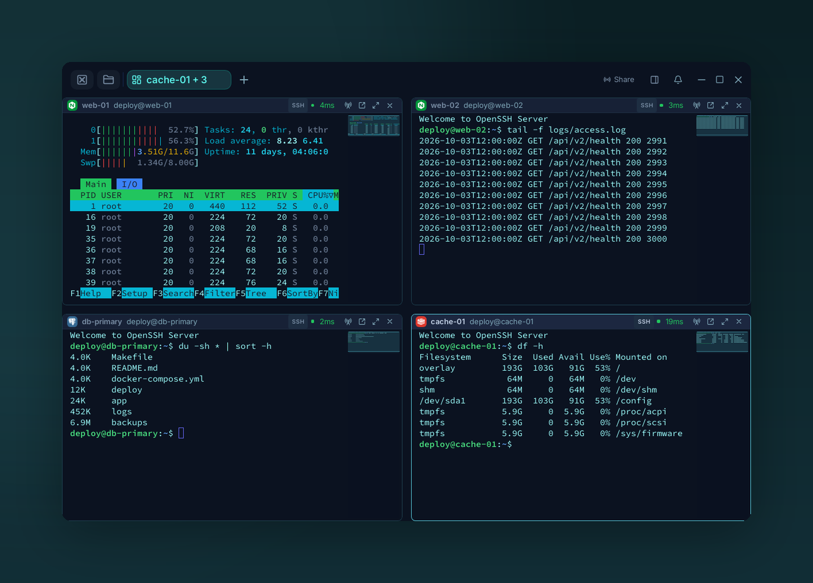
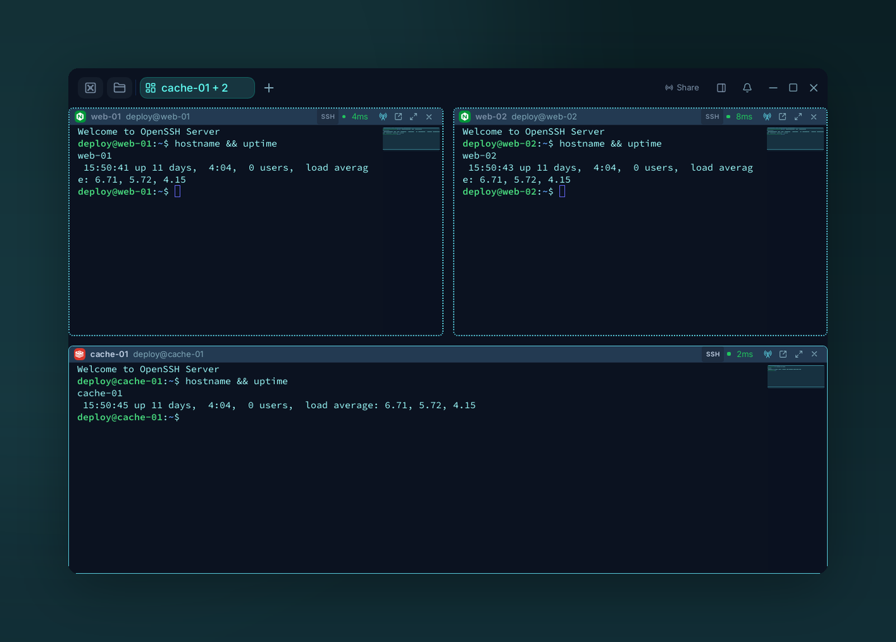

# Split panes

{ .voltius-shot }
/// caption
Split a tab into a 2×2 grid — each pane is its own session (four SSH hosts here).
///

## Splitting

| Action | How |
| --- | --- |
| Split side by side | Right-click the pane header → **Split** → **Split left** / **Split right** |
| Split top / bottom | Right-click the pane header → **Split** → **Split top** / **Split bottom** |
| Open another session in a pane | Drag its tab from the title bar onto the pane (drop zones show where it lands) |
| Resize | Drag the divider |
| Close a pane | Pane header → **×** (or right-click → **Close pane**) |

Panes nest — split a split, no depth limit.

## Broadcast input

{ .voltius-shot }
/// caption
Broadcast input — one keystroke stream goes to every pane in the tab (dotted accent borders show broadcast is on).
///

Click the broadcast icon in any pane header (**Broadcast input**), or right-click the tab → **Broadcast input to all panes**. Every keystroke goes to every connected pane in the tab — useful for running the same command on a fleet. A pane where someone else holds control in a shared session is left out.

While broadcast is on, pane borders turn dotted and headers take the accent tint. Click the broadcast icon again (**Disable broadcast**) to stop.

!!! warning
    Broadcast is per-tab. Closing the tab clears the broadcast set.
