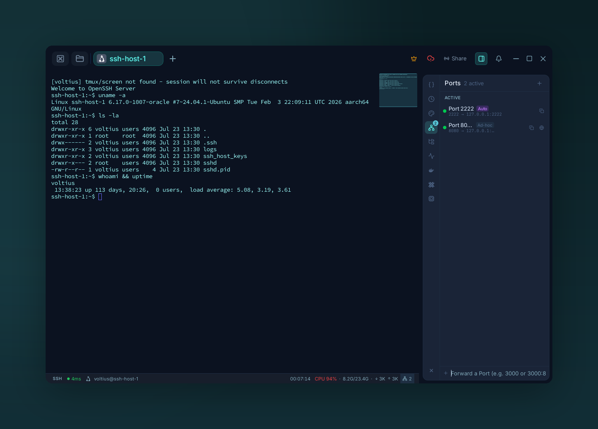

# Port forwarding

{ .voltius-shot }
/// caption
The Ports panel — auto-detected and manually created forwards, live. Type a port to forward one.
///

Three tunnel types, mapped to the OpenSSH equivalents.

## Tunnel types

=== "Local (`-L`)"

    **Open something from the SSH server on your machine.**

    `localhost:3000` on your computer → `127.0.0.1:3000` on the server.

    Use case: reach a service that only listens on the server's loopback.

=== "Remote (`-R`)"

    **Expose something from your machine on the SSH server.**

    The server listens on a port and forwards traffic back to you.

    Use case: share a local dev server with a teammate via a bastion.

=== "Dynamic (`-D`)"

    **SOCKS5 proxy on your machine.**

    Point a browser or app at `localhost:1080` to route all its traffic through the SSH server.

    Use case: browse as if from inside the server's network.

## Creating a rule

**Port Forwarding tab → +**. Pick a tunnel type, the host, the ports.

## Running

Each rule has **Start / Stop** in its card. Active tunnels appear in the **Active tunnels** section at the top of the page with a live status indicator.

!!! tip "Auto-start"
    Tag a rule **Auto-start** to bring it up whenever the host connects.
