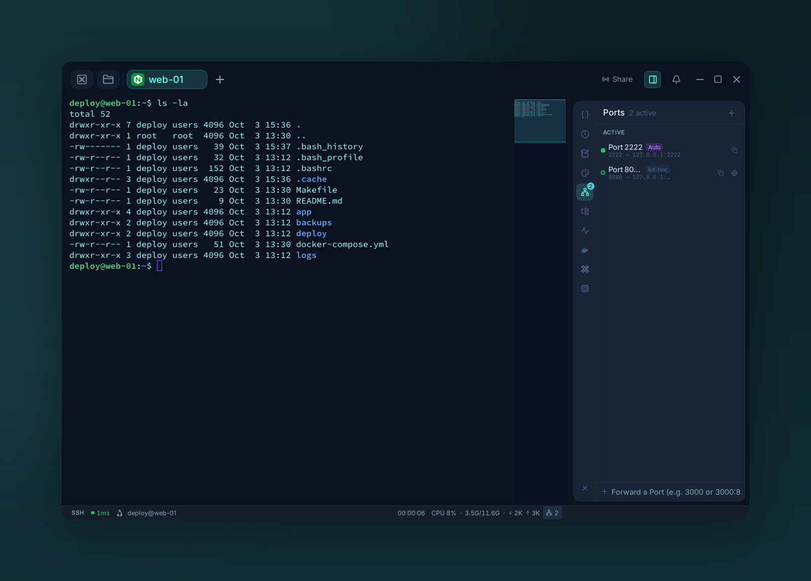
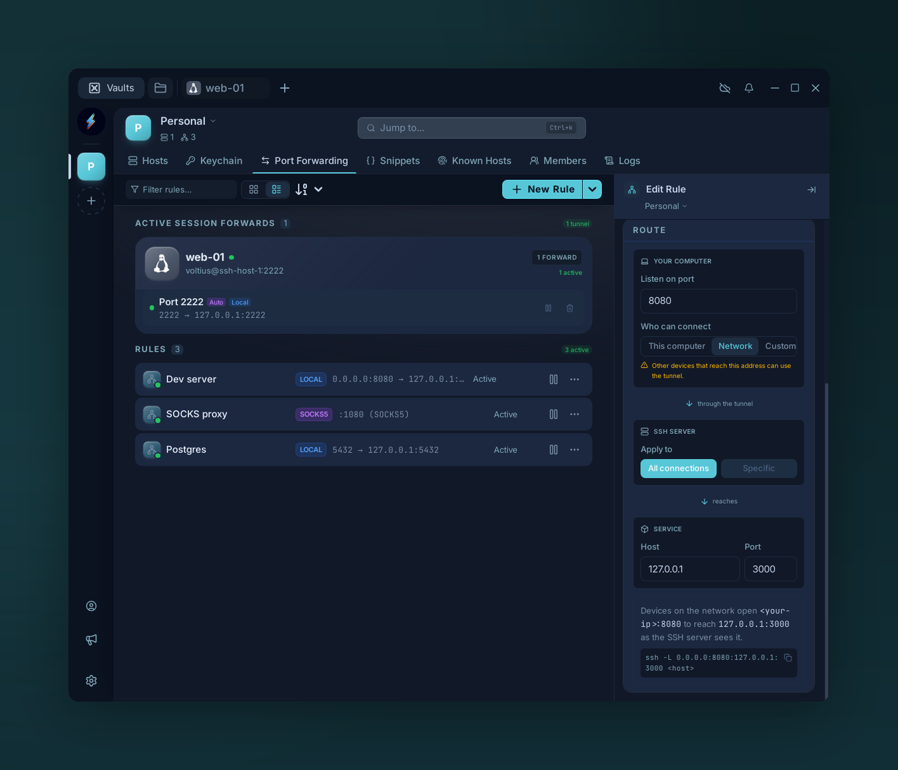

# Port forwarding

{ .voltius-shot }
/// caption
The Ports panel — auto-detected and manually created forwards, live. Type a port to forward one.
///

Three tunnel types, mapped to the OpenSSH equivalents.

## Tunnel types

=== "Local (`-L`)"

    **Open something from the SSH server on your machine.**

    `localhost:3000` on your computer → `127.0.0.1:3000` on the server.

    Use case: reach a service that only listens on the server's loopback.

=== "Remote (`-R`)"

    **Expose something from your machine on the SSH server.**

    The server listens on a port and forwards traffic back to you.

    Use case: share a local dev server with a teammate via a bastion.

=== "Dynamic (`-D`)"

    **SOCKS5 proxy on your machine.**

    Point a browser or app at `localhost:1080` to route all its traffic through the SSH server.

    Set **Who can connect** to **Network** and other devices can use your machine's address and that port as their proxy too.

    Use case: browse as if from inside the server's network.

## Creating a rule

**Port Forwarding** page → **+ New Rule**. The arrow next to it starts a **Local tunnel**, **Remote tunnel** or **Dynamic SOCKS proxy** directly.

{ .voltius-shot }
/// caption
A rule is laid out as the route its traffic takes. The line under it says where traffic goes and gives the matching ssh command.
///

The **Route** section reads top to bottom, in the order traffic travels:

=== "Local"

    1. **Your computer**: **Listen on port** and **Who can connect**.
    2. **SSH server**: **Apply to** **All connections** or **Specific** ones.
    3. **Service**: the **Host** and **Port** to reach, as the server sees them. Leave the host on `127.0.0.1` for a service running on the server itself.

=== "Remote"

    1. **SSH server**: **Listen on port**, **Who can connect** and **Apply to**.
    2. **Your computer**: the **Host** and **Port** that receive the traffic.

=== "Dynamic"

    1. **Your computer**: **SOCKS proxy port** and **Who can connect**.
    2. **SSH server**: **Apply to**.
    3. **Any destination**: each app picks where it goes, and its traffic leaves from the server.

Under the route, one sentence says where traffic will go, followed by the equivalent `ssh` command with a copy button. With exactly one connection selected, the command names that host.

### Who can connect

This sets the address the tunnel listens on: on your computer for local and dynamic rules, on the SSH server for remote ones.

| Choice | Listens on | Who reaches it |
| --- | --- | --- |
| **This computer** (**Server only** for remote rules) | `127.0.0.1` | Only the machine that listens |
| **Network** | `0.0.0.0` | Any device that can reach that machine |
| **Custom** | The address you type, e.g. `192.168.1.2` | Devices that can reach that one address |

Changing a rule between **Remote** and the other two types puts this back on the private choice, because the listener moves to the other machine.

!!! warning "Anything but the first choice shares the tunnel"
    Other devices can then use it without signing in to anything: a shared SOCKS proxy has no password, and a shared local forward exposes the service behind it. A rule in a team vault listens the same way on every member's machine.

A **Custom** address has to belong to the machine that listens. For a remote rule the server also has to allow it (`GatewayPorts` in `sshd_config`).

## Running

Each rule card has a play/pause button (**Resume forwarding** / **Pause forwarding**) and a live status dot. Auto-detected and ad-hoc forwards appear per host in the **Active session forwards** section at the top of the page.

A rule that cannot start turns red and says why on its row, for example **This computer has no address 192.168.1.2**. The same reason shows in the terminal's **Ports** panel. It stays until the next attempt.

!!! tip "Rules start automatically"
    Every rule comes up whenever an SSH session to a host in its scope connects. Use the card's pause button to stop a running rule.
