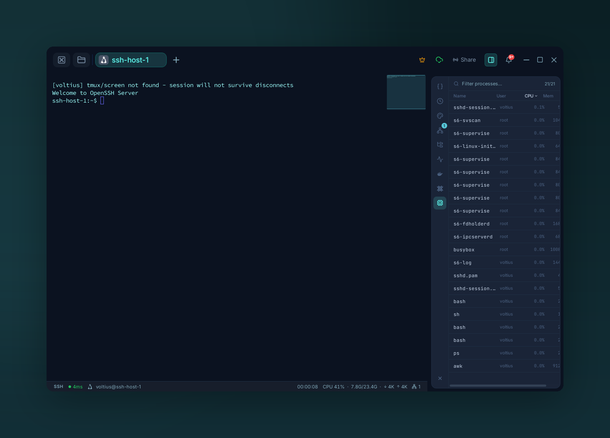

# Process manager

{ .voltius-shot }
/// caption
The process manager — filter and sort remote processes by CPU or memory, and signal them.
///

A live `ps` table with a UI.

## Where

Right-side panel on any active session (Local, SSH, Docker exec). The panel auto-targets the session's host.

## Columns

| Column | Notes |
| --- | --- |
| PID | Process ID |
| User | Owner |
| CPU % | Percent of one core |
| MEM % | Resident memory share |
| Command | Full command line |

Click any column to sort. The list refreshes every few seconds.

## Actions

Right-click a row:

- **Kill** (SIGTERM)
- **Force kill** (SIGKILL)
- **Copy PID** / **Copy command**

!!! warning
    The Process panel runs commands as the connected user. You can only kill what your user owns (unless you connected as `root`).
