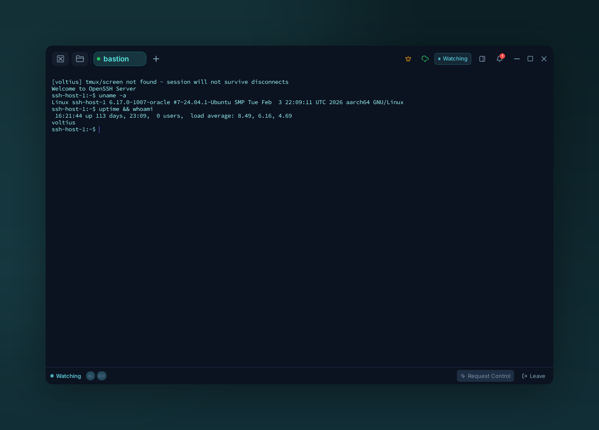

# Sharing

{ .voltius-shot }
/// caption
Guests watch the session live as it happens. Any guest can request control; the host grants or revokes it, and either side can leave whenever.
///

Live, collaborative terminal sessions.

## Plans

| Plan | Active sessions | Guests per session |
| --- | --- | --- |
| Free | — | — |
| Pro | 1 | 1 |
| Teams | 5 | 10 |
| Business | 20 | 50 |

## Sharing a session

Open the **Share** menu on a terminal tab → **Start sharing**. Voltius generates a one-time link. Send it via your channel of choice.

## What guests can do

| Mode | Guest can |
| --- | --- |
| **View** | Watch the session live |
| **Control** | Type into the terminal |

You stay the host — kicking guests is one click in the multiplayer bar.

## Audit

Every shared session is recorded in the [audit log](../teams/audit-logs.md) (Teams/Business): who joined, when, what they typed (Business only).

!!! warning "Out-of-band auth"
    Share links don't authenticate by themselves — anyone with the link can join. Send via a channel you trust.
