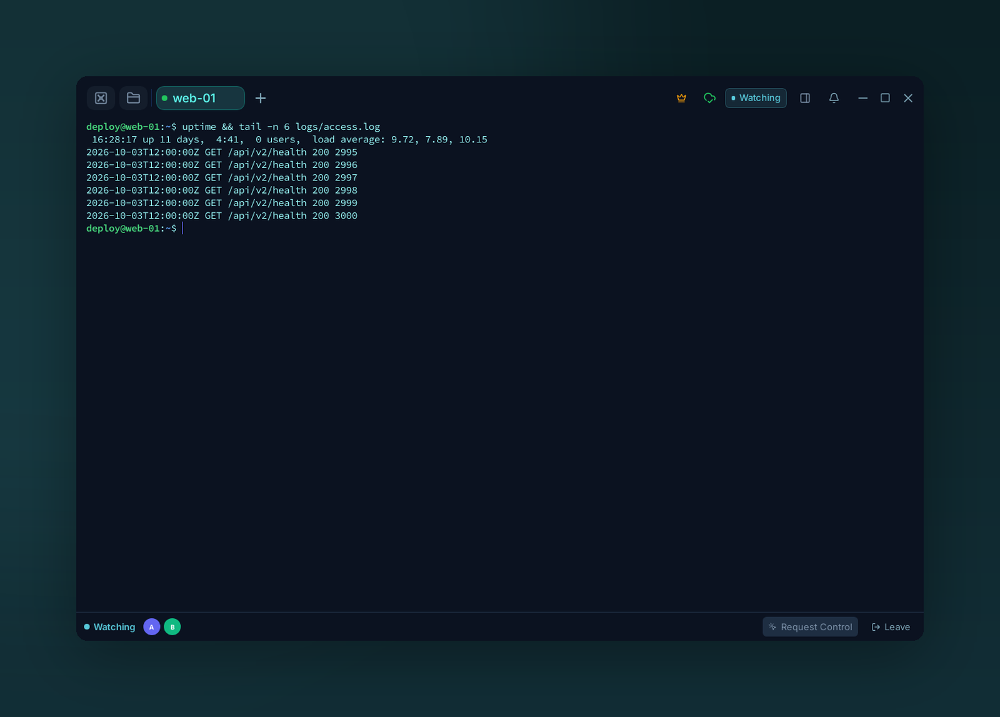

# Sharing

{ .voltius-shot }
/// caption
Guests watch the session live as it happens. Any guest can request control; the host grants or revokes it, and either side can leave whenever.
///

Live, collaborative terminal sessions.

## Plans

| Plan | Active sessions | Guests per session |
| --- | --- | --- |
| Free | — | — |
| Pro | 1 | 1 |
| Teams | 5 | 10 |
| Business | 20 | 50 |

Free users can still share a connection stored in a team vault whose owner is on Teams or Business; the session counts against the owner's plan.

## Sharing a session

Click **Share** in the title bar while a terminal is focused. Pick **People** to invite specific users, **Team vault** to share with a vault's members, or **Link** → **Generate invite link**. Voltius copies the link to your clipboard; it works until you stop sharing, so send it via a channel you trust.

## What guests can do

| Mode | Guest can |
| --- | --- |
| **View** | Watch the session live |
| **Control** | Type into the terminal |

You stay the host. **Revoke** in the multiplayer bar takes control back, **Withdraw** in the Share popover removes someone you invited, and **Stop** ends the session for everyone.

## Audit

Terminal sharing is not recorded in the [audit log](../teams/audit-logs.md), except when an AI agent shares, unshares, or hands off control through MCP (Teams/Business).

!!! warning "Out-of-band auth"
    Share links don't identify who is joining: anyone with the link and a Voltius account can join, up to your plan's guest limit. Send via a channel you trust, or use **People** to invite named users.
