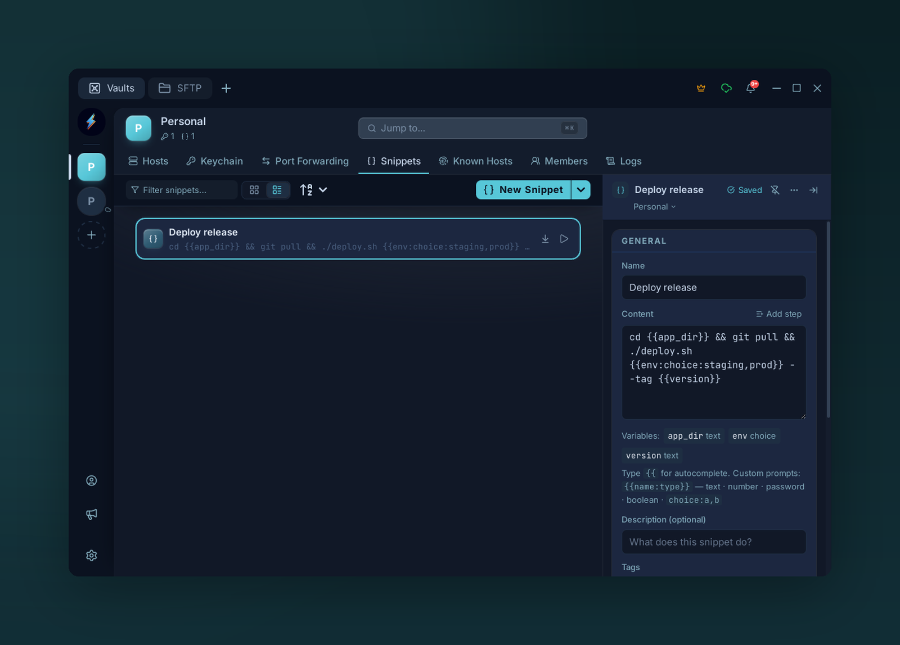
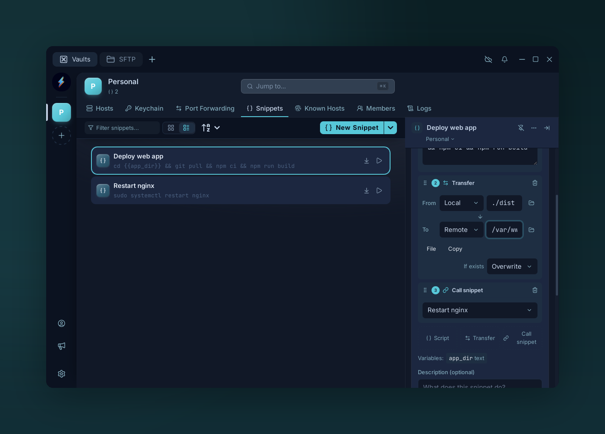
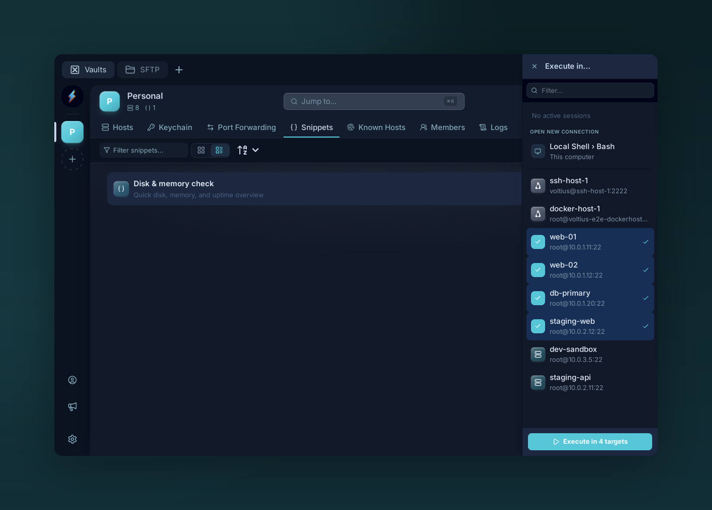

# Snippets

{ .voltius-shot }
/// caption
Snippets store reusable commands; {{variables}} become typed prompts filled in at run time.
///

Saved commands you can run from the command palette, a context menu, or a keyboard shortcut.

## Create

**Snippets tab → +**, or from the omni search → **Create snippet from clipboard**.

| Field | Notes |
| --- | --- |
| **Name** | Display label |
| **Content** | The command(s). Multi-line is supported — runs as one paste. Grows into a [step sequence](#sequences) once you **Add step**. |
| **Description** | Optional. Surfaces in the command palette. |
| **Tags** | Filter in the Snippets list |
| **Targets** | Which hosts/tags this snippet appears on (context menu) |
| **Shortcut** | Optional keybinding |

## Variables

Embed dynamic values with `{{name}}` syntax:

| Built-in | Value |
| --- | --- |
| `{{connection.host}}` | Active SSH hostname / IP |
| `{{connection.username}}` | Active SSH username |
| `{{connection.name}}` | Active connection name |
| `{{date}}` | `YYYY-MM-DD` |
| `{{datetime}}` | `YYYY-MM-DD HH:MM:SS` |
| `{{timestamp}}` | Unix timestamp |
| `{{clipboard}}` | Current clipboard contents |

User variables — any other `{{name}}` — prompt for input before execution. Variables are collected across **every** step of a [sequence](#sequences) (script bodies *and* transfer paths) and prompted for once, together, before the sequence runs.

## Sequences

{ .voltius-shot }
/// caption
A snippet is an ordered sequence of steps. Mix script blocks, file transfers, and calls to other snippets; drag to reorder.
///

A snippet is really an **ordered list of steps**. A snippet with a single script step stays the simple case above — just the **Content** box. Press **Add step** to turn it into a sequence: the Content box becomes a numbered step list with a **drag handle** to reorder and three add buttons.

Steps run **top to bottom**, in order, against the active connection.

### Step kinds

| Kind | What it does |
| --- | --- |
| **Script** | A command/script block — the classic snippet body. Supports `{{variables}}`. |
| **Transfer** | Copy or move a file/folder between **Local** and **Remote**. |
| **Call snippet** | Runs another saved snippet inline. Sub-snippets can nest. |

#### Transfer

A transfer step moves data between your machine and the remote host — in either direction, without leaving the snippet.

| Field | Notes |
| --- | --- |
| **From** / **To** | Each endpoint is **Local** or **Remote** — so all four combinations work (upload, download, local→local, remote→remote). |
| **Path** | Source and destination paths. The **folder** button opens a picker: a native dialog for Local, the remote path browser (pick a host, then browse) for Remote. |
| **File / Folder** | Toggle whether the path is a single file or a whole directory. |
| **Copy / Move** | *Move* deletes the source after a successful transfer; *Copy* leaves it. |
| **If exists** | Conflict policy when the destination already exists: **Overwrite**, **Skip**, or **Fail** (stops the sequence). |

#### Call snippet

Pick another snippet from the dropdown and its steps run in place, as if pasted into this one. Calls can nest — a called snippet may itself call others. Voltius flattens the whole tree before running; self-references and cycles are detected and stopped rather than looping forever.

### Add, reorder, remove

- **Add** — the dashed **Script**, **Transfer**, and **Call snippet** buttons at the bottom of the list append a step of that kind.
- **Reorder** — drag a step by its grip handle; the numbers renumber as you go.
- **Remove** — the trash icon on a step's header deletes it.

Drop back to a single script step and the editor collapses to the plain Content box again.

## Multi-exec

{ .voltius-shot }
/// caption
Run one snippet across many hosts at once. Pick targets from the Execute-in panel — Voltius opens a tab per host (or runs in the background) with the command already executed.
///

From the Snippets toolbar → **Run on…** to pick multiple hosts. Voltius opens a tab per host (or runs in the background) with the snippet executed.

!!! note "Multi-host vs multi-step"
    These are orthogonal. **Multi-exec** runs one snippet across many *hosts*; a **[sequence](#sequences)** runs many *steps* on one host. Combine them: pick several hosts in **Run on…** and the entire step sequence — scripts, transfers, and all — runs against each target, with that host as the Remote endpoint.

## Host pre/post commands

A host's **Pre-command** and **Post-command** (connection form → **Advanced**) each take
either a plain inline command — as they always have — or a saved snippet. Click the `{}`
button beside the field to pick one; the field turns into a chip naming the snippet, and
the `×` on the chip returns it to a plain command box.

A snippet used this way runs its **whole sequence**, so multi-step snippets, `Call snippet`
steps, and file transfers all work. The pre-command runs when the session connects; the
post-command runs when you close the tab, before the connection is torn down.

### Variable prompts

If the snippet uses [variables](#variables), you are prompted for them — on connect for a
pre-command, and on disconnect for a post-command. Because closing a tab is instant, a
post-command prompt appears *after* its tab is gone, so it names the host it belongs to.
Dismissing the prompt skips that command and disconnects immediately; a post-command prompt
left unanswered for 60 seconds does the same, rather than holding the connection open.

Your answers are remembered per host, so a routine connect is one keypress. Two exceptions:

- Variables typed as `password` are **never** remembered.
- Tick **Ask for variables each time** under the fields to stop remembering for that host
  and forget anything already stored for it.

!!! note "Serial hosts"
    Pre/post commands work on serial connections too. File-transfer steps are the one
    exception — there is no SFTP over a serial link, so those steps report an error.
