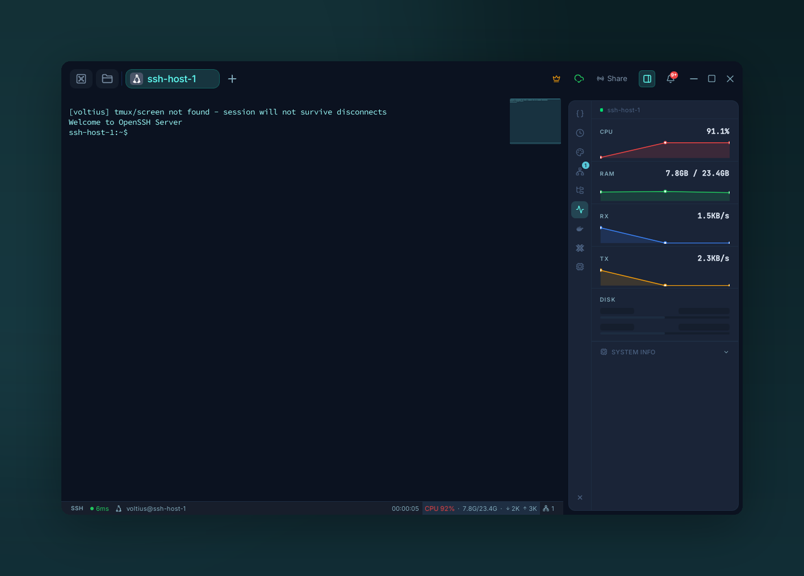

# System monitoring

{ .voltius-shot }
/// caption
The Metrics panel — live CPU, RAM, network, and disk for the connected host.
///

Live stats for the connected host — CPU, memory, disk, network — pushed to the right-side panel.

## What you see

- **CPU** — per-core utilization, load averages.
- **Memory** — used / cached / available.
- **Disk** — usage per mount, read/write throughput.
- **Network** — bytes in/out per interface.

History is kept for the session — close the tab and it resets.

## How it works

Voltius runs a small `top`/`free`/`df`/`ip` probe over the active SSH session every few seconds. No agent install required on the remote host.

!!! tip
    System monitoring works for local terminals too — the same probes run against your local OS.
