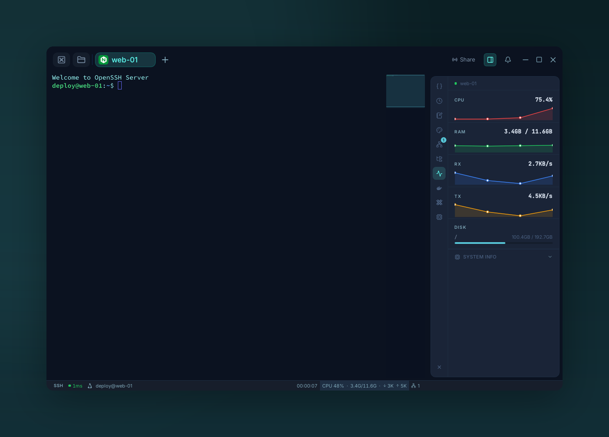

# System monitoring

{ .voltius-shot }
/// caption
The Metrics panel — live CPU, RAM, network, and disk for the connected host.
///

Live stats for the connected host — CPU, memory, disk, network — pushed to the right-side panel.

## What you see

- **CPU** — total utilization, with a sparkline.
- **Memory** — used / total.
- **Disk** — used / total for `/` on SSH hosts, every mounted disk for local sessions.
- **Network** — bytes received / sent, summed across all interfaces.

The sparklines keep the last 60 samples per host. Every tab on that host shares them, and they reset once the host's last session disconnects.

## How it works

Voltius runs one small probe (`/proc/stat`, `/proc/meminfo`, `/proc/net/dev`, `df -P /`) over the active SSH session every second. No agent install required, but the host must be Linux.

!!! tip
    System monitoring works for local terminals too — Voltius reads your OS's stats directly (not on Android).
