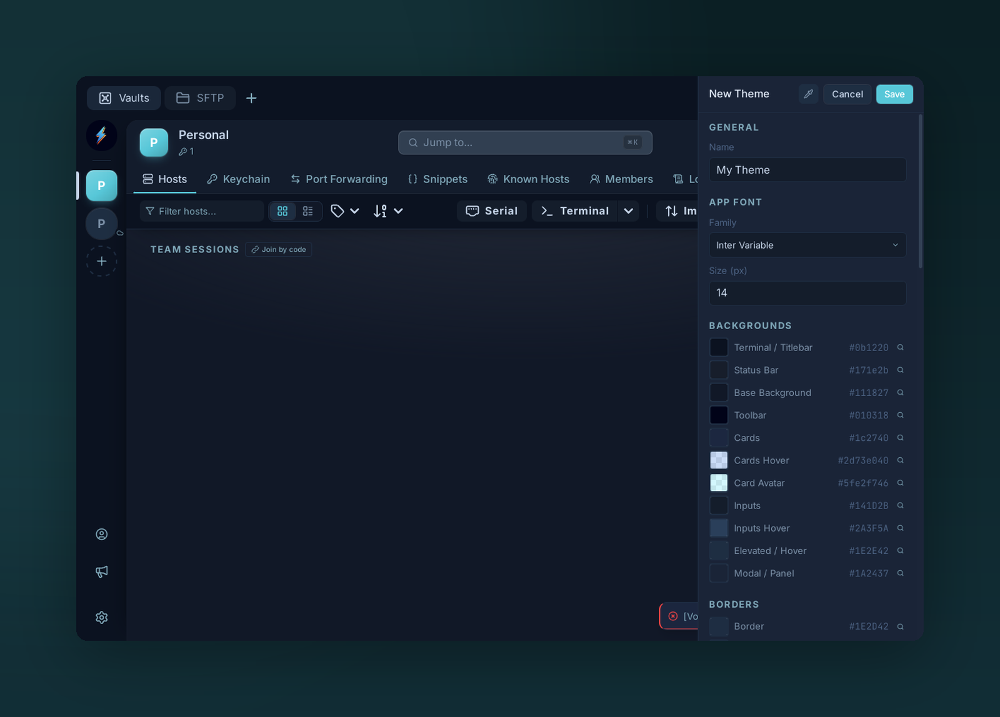
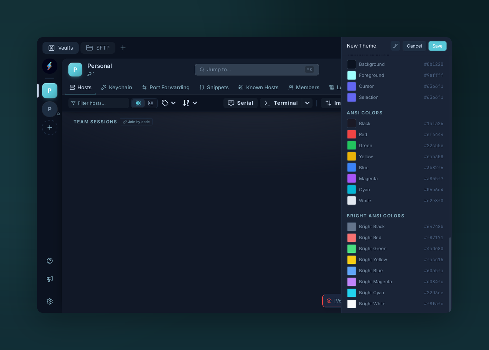

# Themes

{ .voltius-shot }
/// caption
The Theme Creator — tune every surface color, font, and border to build a custom theme.
///

Both the **UI** and the **terminal** are themable from one place.

## Switching themes

**Settings → Appearance → Theme.** Bundled themes ship with the app; more come from [theme plugins](../plugins/index.md) in the marketplace.

## Theme creator

{ .voltius-shot }
/// caption
Scroll to the terminal section to set the ANSI and bright-ANSI palette your shell uses.
///

**Settings → Appearance → Edit theme** (or duplicate an existing one):

- **UI section** — background, foreground, borders, accent, panel chrome.
- **Terminal section** — background, foreground, cursor, 16 ANSI colors.
- **Typography** — font family + size.

Changes preview live. Export creates a JSON file you can share.

## Distributing a theme

Themes are a plugin type. See [Developing plugins → theme example](https://github.com/VoltiusApp/marketplace#complete-example-theme-plugin) and submit to the marketplace.

!!! tip
    Drop a `.json` theme into `$APP_DATA/themes/` to load it without packaging as a plugin — handy for iterating.
