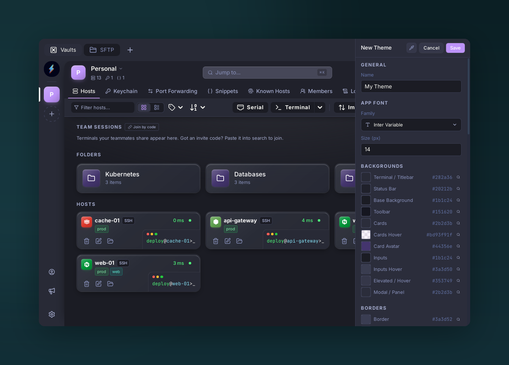
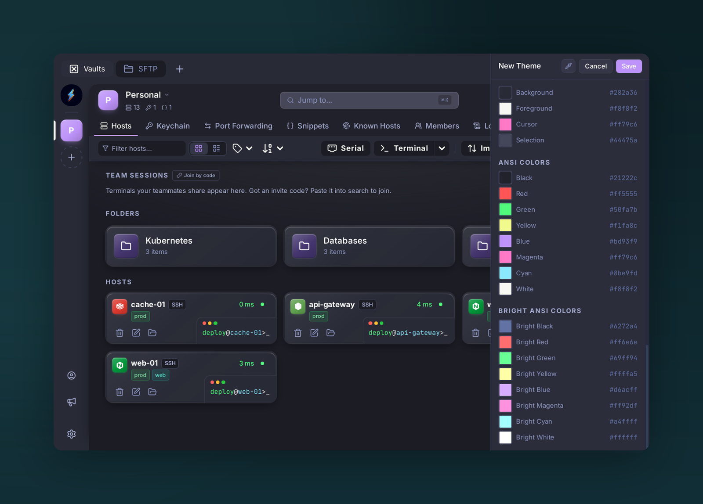

# Themes

{ .voltius-shot }
/// caption
The Theme Creator — tune every surface color, font, and border to build a custom theme.
///

Both the **UI** and the **terminal** are themable from one place.

## Switching themes

**Settings → Appearance → Color Theme**, or **Switch theme…** in the command palette. Bundled themes ship with the app; more come from [theme plugins](../plugins/index.md) in the marketplace.

## Theme creator

{ .voltius-shot }
/// caption
Scroll to the terminal section to set the ANSI and bright-ANSI palette your shell uses.
///

**Settings → Appearance → Color Theme → New Custom Theme** (it starts as a copy of the active theme), or hover a custom theme and click its pencil (**Edit theme**):

- **UI section** — background, foreground, borders, accent, panel chrome.
- **Terminal section** — background, foreground, cursor, 16 ANSI colors.
- **Typography** — font family + size.

Changes preview live. To share themes, use **Export All** in **Settings → Appearance → Color Theme**; the recipient loads the file with **Import**.

## Distributing a theme

Themes are a plugin type. See [Developing plugins → Examples](../plugins/developing.md#examples) (the **Theme plugin** tab) and submit to the marketplace.

!!! tip
    To move custom themes between machines without packaging a plugin, use **Export All** and **Import** in **Settings → Appearance → Color Theme**. Importing replaces your custom themes with the ones in the file.
